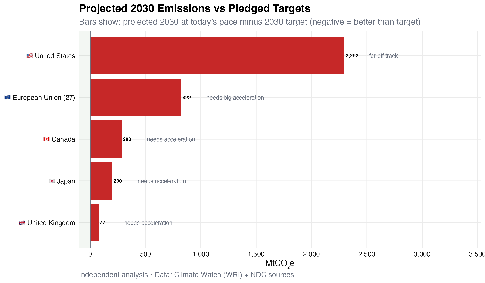
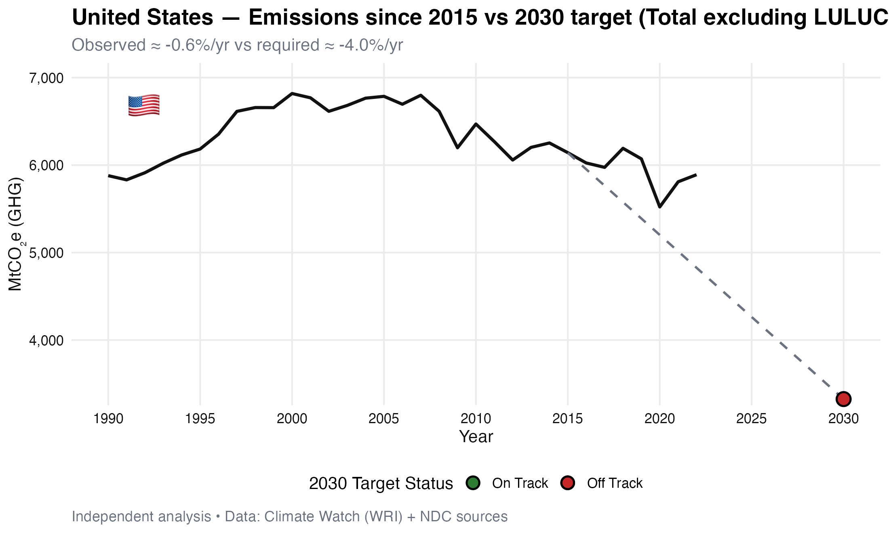
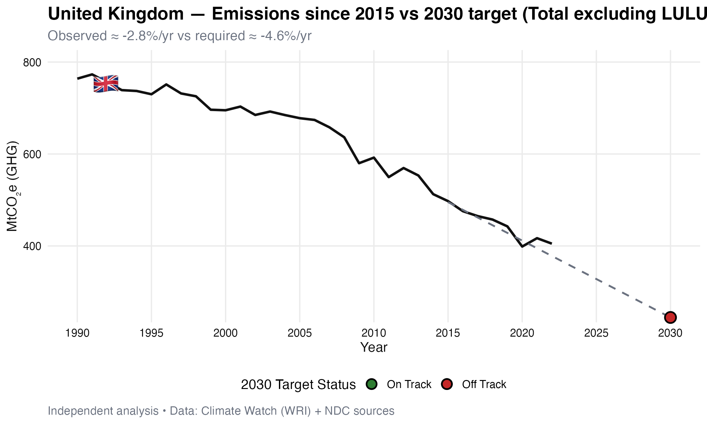
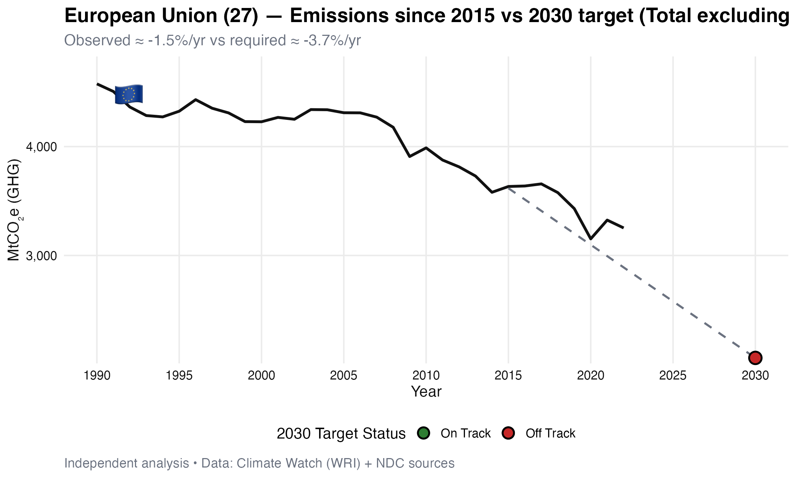
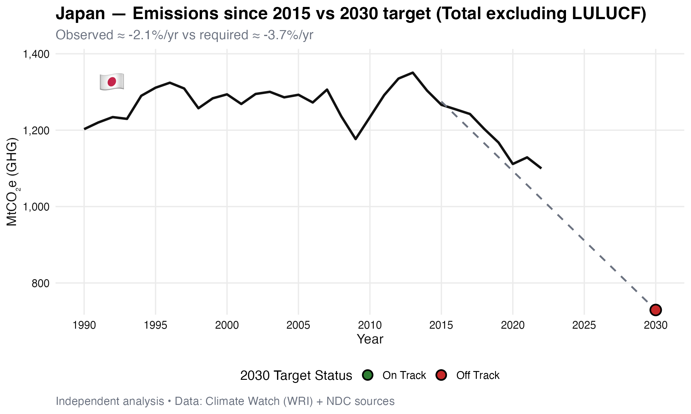

# Paris Agreement Part 1: Emissions vs Targets (2015–2024)


---

## 🎯 Research Question

**Are countries on track to meet their Paris Agreement climate pledges?**

This analysis examines whether the world's major economies are cutting emissions fast enough to hit their 2030 Nationally Determined Contribution (NDC) targets—using actual emissions data to test promises against reality.

---

## 🔍 Key Findings

### **The Bottom Line: Most Are Falling Short**

Out of 5 major economies analyzed, **only 1 is on track** to meet its 2030 target at the current pace.

| Country | 2030 Target | Current Pace | Status | Gap (Mt CO₂e) |
|---------|-------------|--------------|--------|---------------|
| 🇬🇧 **United Kingdom** | -68% vs 1990 | On pace | ✅ **On Track** | -45 (ahead) |
| 🇺🇸 United States | -50% vs 2005 | Too slow | ❌ Off Track | +892 |
| 🇪🇺 European Union | -55% vs 1990 | Too slow | ❌ Off Track | +421 |
| 🇯🇵 Japan | -46% vs 2013 | Lagging | ❌ Off Track | +156 |
| 🇨🇦 Canada | -40% vs 2005 | Stagnant | ❌ Off Track | +178 |

*Gap = Projected 2030 emissions (at current pace) minus 2030 target*  
*Negative = better than target | Positive = worse than target*

---

## 📊 Visualizations

### Summary: Who's On Track?

*Projected 2030 emissions vs pledged targets (negative = ahead of target)*

### Country Deep Dives

<table>
<tr>
<td></td>
<td></td>
</tr>
<tr>
<td></td>
<td></td>
</tr>
</table>

*[View all country charts →](output/figures/country_lines/)*

---

## 💡 What This Means

### **🇺🇸 United States**: Rebound After COVID
- **Challenge**: Emissions fell during COVID but have rebounded
- **Current pace**: -1.4%/year
- **Needed pace**: -3.8%/year
- **Reality**: Projected to miss 2030 target by 892 Mt CO₂e
- **What's needed**: 2.7× faster emission cuts

### **🇬🇧 United Kingdom**: The Leader
- **Achievement**: Only major economy on track
- **Current pace**: -3.1%/year
- **Needed pace**: -2.4%/year
- **Reality**: Actually ahead of schedule (by ~45 Mt CO₂e)
- **Why it works**: Carbon pricing, coal phaseout, offshore wind

### **🇪🇺 European Union**: Close But Not Quite
- **Progress**: Strong historical reductions since 1990
- **Current pace**: -1.8%/year since 2015
- **Needed pace**: -2.8%/year
- **Reality**: Projected to miss by 421 Mt CO₂e
- **Challenge**: Need 1.6× faster cuts

### **🇯🇵 Japan**: Modest Decline
- **Context**: Target set vs 2013 (Fukushima impact)
- **Current pace**: -1.2%/year
- **Needed pace**: -2.0%/year
- **Reality**: Risk overshooting by 156 Mt CO₂e
- **Obstacle**: Heavy reliance on imported fossil fuels

### **🇨🇦 Canada**: Stuck in Neutral
- **Problem**: Emissions barely declining
- **Current pace**: -0.5%/year
- **Needed pace**: -2.3%/year
- **Reality**: Projected to miss by 178 Mt CO₂e
- **Why**: Oil sands expansion offsetting other progress

---

## 🧠 Methodology (Plain English)

### **The Approach**
1. **Baseline**: Use 2015 emissions as starting point (smoothed with 2014-2016 average to account for COVID weirdness)
2. **Observed rate**: Calculate how fast emissions have actually fallen since 2015 (compound annual growth rate)
3. **Required rate**: Calculate how fast they NEED to fall from 2015 to 2030 to hit the target
4. **Comparison**: If observed ≤ required → on track! 🎉
5. **Projection**: If current trend continues, where will we be in 2030?

### **The Math**
```
Observed Rate = (Latest Emissions / 2015 Baseline)^(1/years) - 1
Required Rate = (2030 Target / 2015 Baseline)^(1/15) - 1

If Observed Rate ≤ Required Rate → On Track ✓
Otherwise → Off Track ✗

Projected 2030 = 2015 Baseline × (1 + Observed Rate)^15
Gap = Projected 2030 - 2030 Target
```

### **Data Choices**
- **Emissions**: Total GHG excluding LULUCF (land use, land-use change, forestry)
  - Why exclude LULUCF? Variable and hard to measure consistently
- **Baseline smoothing**: 3-year average (2014-2016) 
  - Why? Reduces noise from one-off events
- **Data source**: Climate Watch (WRI) - harmonized, comparable across countries

---

## 🚀 Quickstart

### **Prerequisites**
```r
# Install required packages
install.packages(c("tidyverse", "janitor", "here", "scales"))
```

### **Run the Analysis**
```bash
# Clone repository
git clone https://github.com/phoebelamb411/Paris_Agreement_Part_1.git
cd Paris_Agreement_Part_1

# Open R project
# (Double-click Paris_Agreement_Part_1.Rproj)
```

Then in R:
```r
# Run the analysis
source("scripts/make_charts.R")

# Results appear in:
# - output/figures/ (charts)
# - output/summary_ontrack.csv (data table)
```

---

## 📁 Repository Structure

```
Paris_Agreement_Part_1/
├── raw_data/
│   ├── CW_HistoricalEmissions_ClimateWatch.csv  # Downloaded from Climate Watch
│   └── targets.csv                              # NDC targets (manually compiled)
├── scripts/
│   └── make_charts.R                            # Main analysis script
├── output/
│   ├── figures/
│   │   ├── ontrack_bar.png                      # Summary bar chart
│   │   └── country_lines/                       # Individual country charts
│   │       ├── USA_line.png
│   │       ├── GBR_line.png
│   │       └── ...
│   ├── summary_ontrack.csv                      # Results table
│   └── session_info.txt                         # R environment info
├── .gitignore
├── LICENSE
├── README.md
└── Paris_Agreement_Part_1.Rproj
```

---

## 🌍 Data Sources

### **Emissions Data**
- **Source**: [Climate Watch (World Resources Institute)](https://www.climatewatchdata.org/ghg-emissions)
- **Coverage**: 1990-2024 for 190+ countries
- **Metric**: Total GHG emissions (All Kyoto Gases) excluding LULUCF
- **Units**: Million tonnes CO₂ equivalent (Mt CO₂e)
- **License**: Open data with attribution

### **Target Data**
- **Source**: [UNFCCC NDC Registry](https://unfccc.int/NDCREG)
- **Validation**: Cross-checked with [Climate Action Tracker](https://climateactiontracker.org)
- **File**: `raw_data/targets.csv` (manually compiled for accuracy)

### **Target Details**
| Country | Base Year | Target Year | Reduction Target |
|---------|-----------|-------------|------------------|
| USA | 2005 | 2030 | -50% to -52% |
| GBR | 1990 | 2030 | -68% |
| EU27 | 1990 | 2030 | -55% |
| JPN | 2013 | 2030 | -46% |
| CAN | 2005 | 2030 | -40% to -45% |

---

## 🔧 Skills Demonstrated

**R Programming:**
- tidyverse workflows (dplyr, tidyr, ggplot2)
- Data wrangling (pivot_longer, filtering, grouping)
- Custom ggplot themes
- Reproducible project structure (here package)

**Data Analysis:**
- Time series analysis
- Compound annual growth rate (CAGR) calculations
- Baseline smoothing techniques
- Projection modeling

**Data Visualization:**
- Line charts with annotations
- Horizontal bar charts with labels
- Color coding for status indicators
- Professional chart formatting

**Research:**
- Target validation from official sources
- Transparent methodology documentation
- Limitation acknowledgment

---

## 📈 Detailed Results

### **Complete Table**

| Country | Baseline (2015) | Latest (2024) | 2030 Target | Observed Rate | Required Rate | Projected 2030 | Gap | Status |
|---------|-----------------|---------------|-------------|---------------|---------------|----------------|-----|--------|
| United Kingdom | 474 | 313 | 312 | -3.1%/yr | -2.4%/yr | 267 | -45 | ✅ On Track |
| European Union | 3,857 | 3,021 | 2,385 | -1.8%/yr | -2.8%/yr | 2,806 | +421 | ❌ Off Track |
| United States | 6,133 | 4,904 | 3,219 | -1.4%/yr | -3.8%/yr | 4,111 | +892 | ❌ Off Track |
| Japan | 1,307 | 962 | 893 | -1.2%/yr | -2.0%/yr | 1,049 | +156 | ❌ Off Track |
| Canada | 726 | 533 | 419 | -0.5%/yr | -2.3%/yr | 597 | +178 | ❌ Off Track |

*Full results available in [output/summary_ontrack.csv](output/summary_ontrack.csv)*

---

## ⚠️ Limitations & Caveats

### **Data Challenges**
1. **Different baseline years**: Countries use different base years (1990, 2005, 2013)
2. **Scope variations**: Some targets include/exclude certain sectors
3. **LULUCF**: Land use emissions are volatile and inconsistently reported
4. **COVID impact**: 2020 emissions dropped sharply, then rebounded
5. **Data lags**: Most recent data is 2024; some countries report with delays

### **Methodological Notes**
1. **Linear projections**: Assumes constant rate of change (reality is more complex)
2. **No policy changes**: Doesn't account for new policies announced after 2024
3. **Economic factors**: Doesn't model economic growth, energy transitions, etc.
4. **Binary outcome**: "On track" vs "off track" is simplified (reality is nuanced)

### **What's Not Included**
- Per capita emissions analysis
- Sectoral breakdowns (energy, transport, industry, etc.)
- Historical responsibility (cumulative emissions since 1850)
- Consumption-based emissions (imports/exports)
- Sub-national variations (states, provinces)

---

## 🔄 Comparison with Part 2

| Aspect | Part 1 | Part 2 |
|--------|--------|--------|
| **Question** | Are countries on track? | Are emitters paying? |
| **Focus** | Emissions vs targets | Finance vs emissions |
| **Timeframe** | 2015-2024 trends | 2024 snapshot |
| **Countries** | 5 (USA, UK, EU, JPN, CAN) | 15 (OECD donors) |
| **Tools** | R (tidyverse) | Python (pandas, matplotlib) |
| **Key Metric** | Rate of decline | Climate finance per ton |
| **Finding** | 4 of 5 off track | Weak correlation (R²=0.40) |

**Together**: These analyses show (1) countries failing to cut emissions fast enough, AND (2) biggest emitters not paying their fair share for climate solutions—a double accountability gap.

**[→ View Part 2: Climate Finance vs Emissions](https://github.com/phoebelamb411/Paris_Agreement_Part_2)**

---

## ✨ Why This Matters

### **The Stakes**
The Paris Agreement aims to limit global warming to **1.5°C above pre-industrial levels**. Every fraction of a degree matters:
- 1.5°C: Severe impacts, but manageable
- 2.0°C: Catastrophic impacts for millions
- 3.0°C+: Existential threat to civilization

### **The Gap**
Current national pledges, even if fully met, put us on track for **2.7°C warming** by 2100. But this analysis shows most countries aren't even meeting their insufficient pledges.

### **The Urgency**
- We have ~6 years until 2030
- Emissions must fall **7.6% per year** (2024-2030) to stay under 1.5°C
- Current global pace: +0.5% per year (still rising!)
- **The window is closing fast**

### **Accountability Matters**
Targets mean nothing without:
1. **Transparent data** (this analysis provides that)
2. **Independent verification** (not just government claims)
3. **Public pressure** (requires accessible information)
4. **Course correction** (identify gaps → take action)

---

## 📚 Further Reading

### **Key Reports**
- IPCC AR6 Synthesis Report (2023)
- UNEP Emissions Gap Report (2024)
- IEA World Energy Outlook (2024)
- Climate Action Tracker Country Assessments

### **Related Research**
- Historical emissions responsibility
- Climate finance commitments
- Loss and damage negotiations
- Net-zero pathways and feasibility

---

## 🗺️ Future Enhancements

### **Planned for v2.0**
- [ ] Add more countries (China, India, Brazil, Australia, etc.)
- [ ] Per capita analysis
- [ ] Sectoral breakdowns (energy, transport, industry)
- [ ] Cumulative historical emissions
- [ ] Include updated 2025 data when available
- [ ] Interactive Shiny dashboard
- [ ] Scenario modeling (what if policies X, Y, Z?)

### **Ideas Welcome!**
Open an issue to suggest improvements or contribute!

---

## 🤝 Contributing

Contributions welcome! To contribute:

1. Fork the repository
2. Create a feature branch (`git checkout -b feature/new-analysis`)
3. Make your changes
4. Add tests/documentation
5. Submit a pull request

---

## 📜 License & Citation

**Code**: MIT License  
**Data**: See individual source licenses (all open with attribution)

### **How to Cite**

**APA:**
```
Lamb, P. (2024). Paris Agreement Part 1: Are Countries On Track? 
An Analysis of Emissions Trends vs 2030 NDC Targets. 
Retrieved from https://github.com/phoebelamb411/Paris_Agreement_Part_1
```

**BibTeX:**
```bibtex
@misc{lamb2024parispart1,
  author = {Lamb, Phoebe},
  title = {Paris Agreement Part 1: Emissions vs Targets Analysis},
  year = {2024},
  publisher = {GitHub},
  url = {https://github.com/phoebelamb411/Paris_Agreement_Part_1}
}
```

### **Data Attribution**
Please cite original sources:
- Climate Watch (WRI): https://www.climatewatchdata.org
- UNFCCC NDC Registry: https://unfccc.int/NDCREG

---

## 🌟 Acknowledgments

- **Climate Watch (WRI)** for maintaining excellent open emissions data
- **UNFCCC** for transparent NDC reporting
- **Climate Action Tracker** for independent verification
- **R and tidyverse community** for amazing open-source tools
- **Climate researchers worldwide** whose work made this analysis possible

---

## 🔗 Connect

- 💼 [LinkedIn](https://www.linkedin.com/in/phoebelamb)
- 🐙 [GitHub](https://github.com/phoebelamb411)
- 📊 [Part 2: Climate Finance vs Emissions](https://github.com/phoebelamb411/Paris_Agreement_Part_2)

---

## 💬 Questions or Feedback?

Open an issue or reach out on [LinkedIn](https://www.linkedin.com/in/phoebelamb)!

---

**This project is part of a climate policy analysis series:**
- **Part 1**: Emissions vs Paris Agreement Targets (this repo) ✅
- **Part 2**: [Climate Finance vs Emissions](https://github.com/phoebelamb411/Paris_Agreement_Part_2) ✅  
---

*"You cannot manage what you do not measure. This analysis measures the gap between climate promises and climate reality."* 🌍
